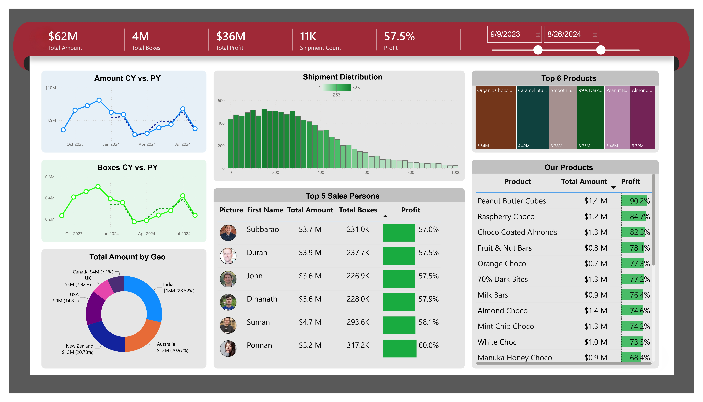

# 🍫 Chocolate Shipments Analysis Dashboard

A comprehensive **Power BI Business Intelligence Dashboard** developed to analyze chocolate sales, shipments, profitability, product performance, and sales trends across multiple countries.

---

## 📌 Project Overview

This project provides interactive visualizations to help stakeholders understand:

- Sales performance
- Profitability analysis
- Shipment trends
- Product performance
- Geographic analysis
- Salesperson performance
- Year-over-Year (YoY) comparisons

The dashboard enables business users to make data-driven decisions through interactive filters and detailed KPIs.

---

## 📸 Dashboard Preview





---

## 📊 Dashboard Features

### 📈 Sales Analysis
- Total Sales Amount
- Total Boxes Sold
- Amount per Box
- Sales by Product
- Sales by Team
- Sales by Geography

### 💰 Profit Analysis
- Total Profit
- Profit %
- Product-wise Profitability
- Country-wise Profit
- Salesperson Profit Analysis

### 🚚 Shipment Analysis
- Shipment Count
- Monthly Shipment Trend
- Shipment Distribution
- Shipment Performance by Team

### 🌍 Geographic Analysis
- Sales by Country
- Profit by Country
- Country-wise Product Performance

Countries Included:
- Australia
- Canada
- India
- New Zealand
- UK
- USA

### 👨‍💼 Salesperson Analysis
- Total Sales
- Total Boxes Sold
- Amount per Box
- Profit Percentage
- Top Performing Salespersons

### 📅 Time Intelligence
- Year-over-Year (YoY) Sales Comparison
- Monthly Trend Analysis
- Current Year vs Previous Year
- 12-Month Variance Analysis

---

## 📊 KPIs

The dashboard tracks key business metrics including:

- Total Sales Amount
- Total Profit
- Profit %
- Shipment Count
- Total Boxes Sold
- Product-wise Revenue
- Team Performance
- Geographic Performance

---

## 🛠 Tools & Technologies

- Microsoft Power BI Desktop
- Power Query
- DAX (Data Analysis Expressions)
- Data Modeling
- Interactive Visualizations

---

## 📂 Repository Structure

```
Chocolate-Shipments-Analysis/
│
├── Chocolate-shipments-Analysis.pbix
├── Chocolate-shipments-Analysis.pdf
├── README.md
└── screenshots/
```

---

## 📈 Dashboard Pages

The report includes multiple analytical dashboards covering:

- Sales Overview
- Profit Analysis
- Shipment Analysis
- Salesperson Performance
- Year-over-Year Comparison
- Product Performance
- Executive Dashboard

---

## 🎯 Business Insights

This dashboard helps answer questions such as:

- Which products generate the highest revenue?
- Which products are most profitable?
- Which countries contribute the most sales?
- How are shipments changing over time?
- Which salespersons perform the best?
- How does current performance compare with the previous year?
- Which teams contribute the most revenue?

---

## 🚀 Skills Demonstrated

- Data Cleaning
- Data Modeling
- DAX Measures
- KPI Design
- Time Intelligence
- Interactive Dashboard Design
- Business Analytics
- Data Visualization
- Performance Analysis

---


## 👨‍💻 Author

**Pavan Kumar Mathurthi**

LinkedIn: *Add your LinkedIn URL*
